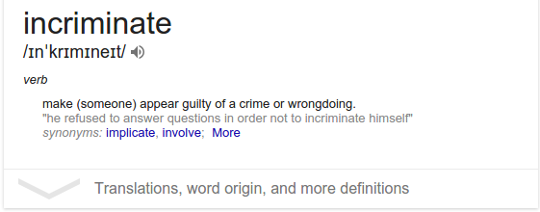

Did you know that ^^ ? Well I didn’t, but all I needed to do was type “define Incriminate” on Google search and hit enter.

Google’s dictionary feature (“define [word]” feature) is really cool. Need to make sure using the right word, wish to know the correct pronunciation, or looking for a pretentious synonym for your email/blogpost/mag-article/class-presentation … Google dictionary is the feature to resort to!

> “Words are easy, people are not.”

Alas, if words were all that were required to understand this complicated place we call ‘world’, humans would have made longer strides in, ahh… , (almost) everything. (And news and media wouldn’t have been flooded with the intolerance issue.)

I am really looking forward to the day Google would add a “define [person_name]” feature” and announce it to the world. Once in awhile I try Googling people just in case Google added the feature but the news agencies of the world were busy discussing Donald Trump and the tech geeks were busy debating “Google/Facebook public surveillance issue”. 

Try searching for some person using Google search. You will only have Google throwing at you links to online profiles belonging to either the person or some other person going by the same name. I don’t know about you but there certainly is lot more to my life than my Facebook, Quora, LinkedIn, Instagram, Google Plus profile, or this blog for that matter of fact.

Not more than two autumns back, I was determined to define someone. I tried Googling, stalked online profiles, enquired people. No use.

So, Google search failed me!

Apparently, even Google’s tremendous processing power of over 100 petaflops, more than 15 exabytes of accumulated data, world’s best data analytics capabilities and constant people tracking & surveillance are not sufficient when it comes to defining humans. (And if Google can’t do it, I don’t expect any other tech giant to even think about it - yeah I am a Google fanboy.)

In case you have not been able to move ahead of the question “Who is this person I was so keen on figuring out” - well he goes by the name ‘Samyak Choudhary’. (No clicks? Hint : You are reading his blog right now.)

I remember having the following conversation with my dad just few days before arriving at IITR. (I am not certain whether it ‘actually’ happened or was it just in my mind. Given the amount of time ‘hypothetical’ conversations run in my head, it’s difficult to distinguish between the two.) :

  **Me** (filled with the ‘just cleared JEE enthusiasm’, with sparkling cheerful eyes) : Dad, college begins in a week now and I have no idea of what I will be like. How will I present myself ? What kind of people will I meet, will they be like me or will they be like most of my school mates? What can I do make people like me and to make new friends ? I don’t want IIT life to be like JEE, I wish to have fun but I also plan higher studies and have to be good in academics ...

  **Dad** : Wow, slow down! Just be yourself, don’t shy away from talking with people and everything will be great.

  **Me** : Be myself, but I don’t know who I am or what I will like to do or ...

  **Dad** (with a puzzled look) : Why, I thought you were certain you wanted to do research in Physics, do a Phd from .. and seem to be too obsessed with trying to become popular now, I don’t remember you being concerned about it earlier in school. Why this sudden change ?

  **Me** : I don’t know, looking for a change I guess. (gives a fake laughter)

  **Me (think to myself)** : perhaps because till now I had been the intersection of what you wanted me to be and what I could be … but not what I wanted to be. And the physics thing, that was class 10th!

Defining our own personal identity can take a lifetime and to complicate matters, our identity changes throughout that period whether or not we consciously undertake a process of personal development.

The biggest hurdle in defining ourselves comes when there is a conflict of definition between how society defines us and how we define ourselves.

There are times when those around us label us as someone we are not, when the mirror image of what society is suggesting doesn’t reflect who we really are. 

Worse are those moments when the untrue image coming back to us feels so real that we begin to tell ourselves this is how things are supposed to be.

The world (and my life) seems to be overly saturated with people hardwired to jump to conclusions without grasping the complete picture - people who try to pigeonhole others based on circumstantial evidence. Friends, relatives, peers, people with no first degree connection, no group is free from such smart judgemental people.

(Btw, jumping to conclusions is a recognized cognitive distortion!)

Every guy (or girl) who loves maths or physics in school is not into research, every computer science major is not a nerd, every incisive critic is not arrogant, every nonconformer is not a crackpot, every stoic person is not cold and every playful conversationalist is not a flirt. But then it is a stereotypical world out there.

Someday, when you are in the mood of reading a rather dramatic story of how my futile attempts to gain social acceptance, my ludicrous susceptibility to accept challenges, an unthinking self-seeking girl, and a stereotypical world, made me suffer from the ordeal of social stigma, read <a href = "../How-one-chat-can-change-your-life">“How one chat can change your life”.</a>

(I would insist you to click on the above hyperlink right away, read the story and come back here)

The climax of the story comprises of me standing on my best friend’s fifth floor balcony railing and contemplating a 60ft plunge into solid concrete below.

Fortunately (unfortunately?), I changed my mind. I love being famous but not with a with a distorted face, cracked skull picture of me being published in media! 

(and to be a little more honest, I was wearing really tight jeans. I don’t know if people get to change clothes in afterlife but I was not taking any chances. :D ).

No regrets though because what followed was pure epiphany.

“We are bestowed with choice, to choose the ‘truth’ that determines our future”

No one gets to decide who we are, who we can be, what values we can have, what we can achieve, but ourselves. In moments of dissonance between who we think we are and what society says we are, the truth that wins is the one WE CHOOSE to believe.

We all can dream a far bigger dream than anybody can indicate for us. Unfortunately, we often let fear of social stigma curb our aspirations and are subdued by tyranny of low (realistic?) ambition.

Battling the majority opinion is difficult, and majority of us end up getting conquered. We tend to forget our version of us. Most of the times the hints are too subtle and we happen to be fighting an unconscious battle, against unknown enemies. At other unfortunate (fortunate?) times, as in my aforementioned story, the brutality of forced majority opinions manages to invade our conscious selves and unawareness can no longer save (fool?) us.

The pivotal question on which the course of our entire life matters - “Who am I” - is so underrated and thoughtlessly disregarded, it is no wonder we so often forget who we really are.

Of course, personal identification goes beyond name, age, family background, job or educational qualifications. It is much deeper than that. It is about what values we live by, what do we strive to achieve, what do we wish to be recognized for, what do we intend to be remembered as, what do we desire to be as an individual.

Personal identification matters. The mind operates differently depending on how self is recognized. From day to day choices to life changing decisions, personal identification serves as an internal counselor. It helps align every action and decision with a recognized cause (the cause governing our lives). It provides the self motivation to keep going when life seems unbearable. It gives us the strength & support to stand up to our convictions and fight for them if need be.

Anyway, I guess I should stop droning now. Too much of deep stuff to digest already and I don’t want my reader to spend the entire night introspecting (being an insomniac, I am well acquainted with the price of sleepless nights). Just remember, while you won’t get a medal for how you define yourself, nor will it help in increasing your grade point (it might actually bring it down!), self-definition matters because your life depends on it. Don’t be swayed by other's opinions on who you are because no one gets to decide that but yourself (however, that does not mean shutting yourself off from feedback!). 

And yeah, <a hreaf = "../Be-honest-in-defining-yourself">self definition is an area where one needs to be completely honest </a> because dishonesty, in this domain, comes at a great personal cost.

Peace Out.
